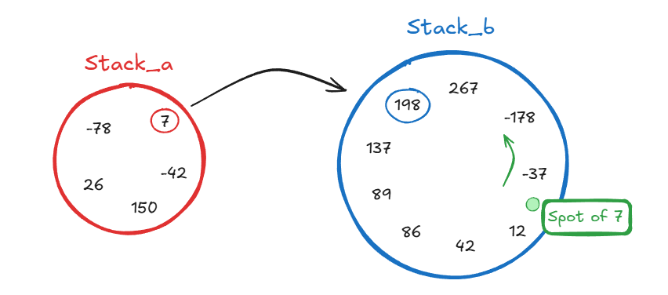

# Push_swap

## Description

### Algo choices

#### Simple sort
Initially a bubble sort was chosen to make this project but after implementing it testing it out, we figured pretty fast that bubble sorting our stacks was highly inefficient and a better sorting algorithm ought to be chosen. Especially since our sorting or at least the logic of it is also used in our medium algorithm.

After reading some docs on the differents O(n²) algorithms proposed, the insertion sort algorithm appeared to be the better choice.

#### Medium sort

#### Complex sort

### Usage examples

### Feature list

### Technical choices

## Instructions

## Resources
