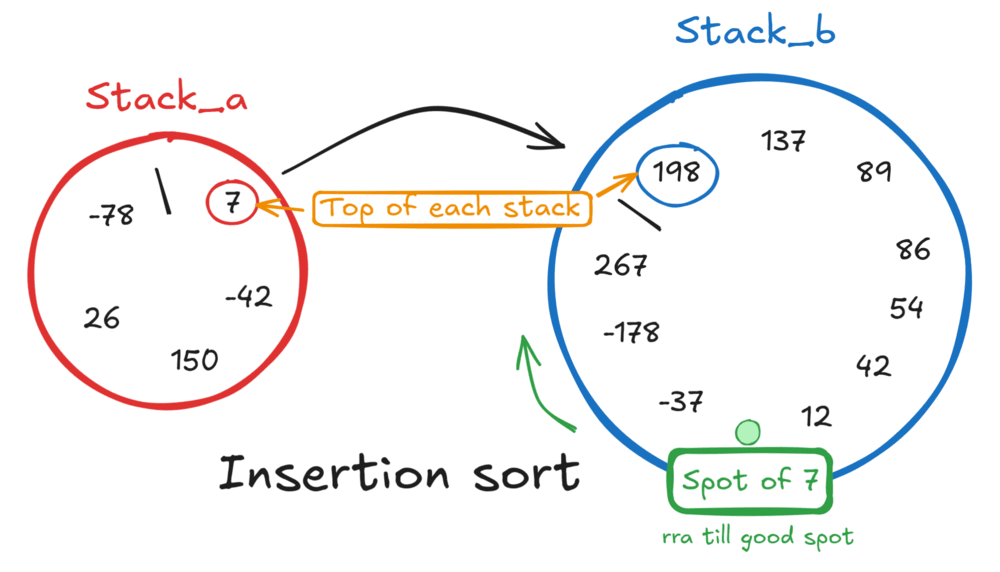
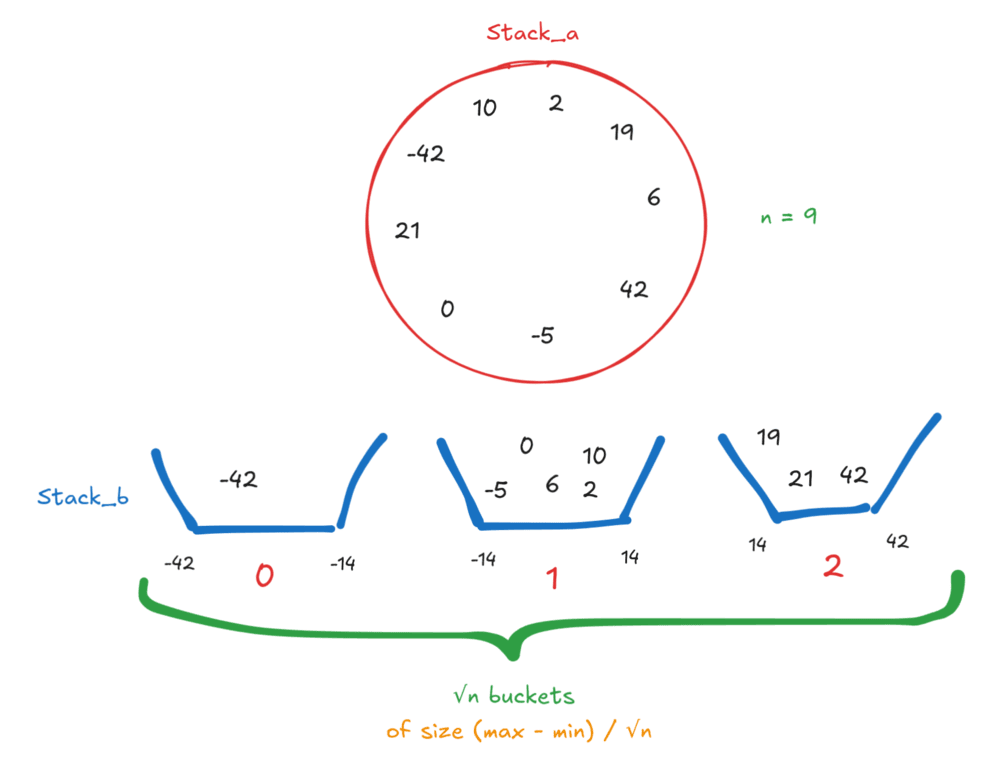
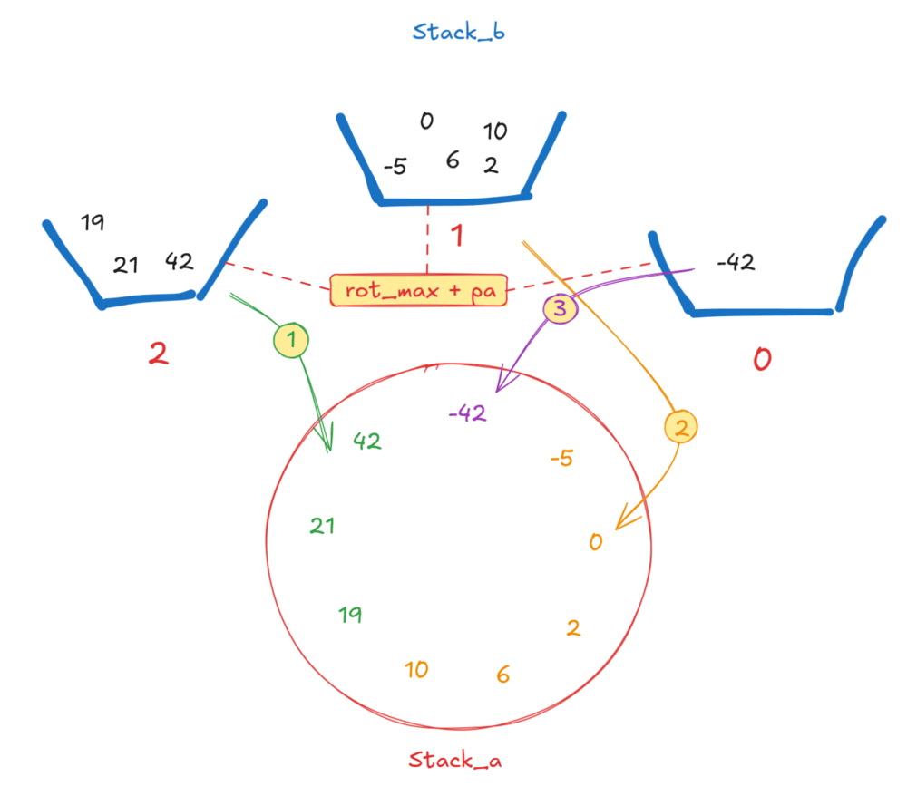

*This project has been created as part of the 42 curriculum by bfitte and gmach.*

# Push_swap
*Two stacks and a dream. Perfectly sorted, as all things should be.*

## Description
We have a list of integers in disorder, two stacks and a set of allowed operations to manipulate both stacks.

Push_swap is a program which calculate and display on the standard output the smallest list of operations that sort the integers received as arguments.
The allowed operations are :

* `sa` (swap a): Swap the first two elements at the top of stack a.
Do nothing if there is only one or no elements.

* `sb` (swap b): Swap the first two elements at the top of stack b.
Do nothing if there is only one or no elements.

* `ss` : sa and sb at the same time.

* `pa` (push a): Take the first element at the top of b and put it at the top of a.
Do nothing if b is empty.

* `pb` (push b): Take the first element at the top of a and put it at the top of b.
Do nothing if a is empty.

* `ra` (rotate a): Shift up all elements of stack a by one.
The first element becomes the last one.

* `rb` (rotate b): Shift up all elements of stack b by one.
The first element becomes the last one.

* `rr` : ra and rb at the same time.

* `rra` (reverse rotate a): Shift down all elements of stack a by one.
The last element becomes the first one.

* `rrb` (reverse rotate b): Shift down all elements of stack b by one.
The last element becomes the first one.

* `rrr` : rra and rrb at the same time.

The parsing is also managed and multiple flags can be added to choose a specific algorithm or to print detailed information about the strategy, number of operations used and an estimate of the input disorder.

|Supported flags:| Description |
|-------------| ---------|
| `--simple`  | force insertion-based simple sort (O(n²)).|
| `--medium`  | force bucket-based medium sort (O(n√n)).|
| `--complex` | force radix-based complex sort (O(n log n)).|
| `--bench`   | print informations (strategy, operation counts, disorder ratio) to stderr.|


## Algo choices
For this project we had to propose 3 different algorithms with different complexity class : `O(𝑛²)`, `O(𝑛√𝑛)` and `O(𝑛log𝑛)`.
Depending on the **disorder** of the list that we have to calculate, the programm shall choose the best algorithm for it.

### Simple sort : Insertion
Initially a **bubble sort** was chosen to make this project but after implementing it testing it out, we figured out pretty fast that bubble sorting our stacks was highly inefficient and a better sorting algorithm ought to be chosen.

After reading some docs on the differents O(n²) algorithms proposed by the subject, the **insertion sort** algorithm appeared to be the better choice.
Here's an illustration of a basic operation in an insertion sort :



The insertion sort has 3 different triage :
- if top of `stack_a` is a `new_min` of `stack_b`, we place the old `min_b` at the **bottom of stack_b** and `pb` the `new_min`.
- if top of `stack_a` is a `new_max` of `stack_b`, we place the old `max_b` at the **top of stack_b** and `pb` the `new_min`.
- if top of `stack_a` is neither `max` or m`in` of `stack_b`, we need to find the **good spot** for it.

### Medium sort : Buckets

For the medium sort, a **bucket sort** has been used. Very similar to the chunk method, bucket sort consists of **splitting the value range into √n buckets**. This effectively performs a pre-partition of the data, making the final ordering easier when pushing back from `b` to `a` by extracting bucket by bucket. Unlike even-sized “chunks” by count, our buckets are even by value range: buckets span equal intervals between the input `min` and `max`, which leads to unbalanced counts in practice but simpler thresholding and rotations.

First we create `√n buckets` of `size = (max - min)/√n`. Then we fill each bucket successively one by one without sorting them but **in order**. In our case, we will just **fill** `stack_b` with the numbers in each bucket successively: we **go through** `stack_a` and if we find a **value belonging to the bucket** we're filling we **send it to b**. Once the stack_a has been run through entirely, we fill the **next bucket into b**.



Then we send the **max of stack_b** in stack_a till **stack_b is completely empty**. Since stack_b is already partly sorted by bucket, the triage will be way faster than the simple method if the list to sort is large enough.



### Complex sort : Radix
Initially I tried to do this algorithm with a merge sort. But the method I found
needed a first fake node to work which distorted the results. So I switched to
Radix sort. It consists of sorting numbers firstly by the units, then by the tens,
then by the hundreds, etc...

To do that I started by creating an array with all values inside my chain, then sort this array with a bubble sort and replace all values in my chained list by their index in the sorted array. It permits to handle negative numbers because, now, we don't have
to handle the sign anymore.
After that, normally, we compare by the units and we push 1 in stack_1, 2 in stack_2, etc...
Except that here we have just two stacks.
So I have to compare the index numbers in binary base.
For that I use this syntaxe
```c
(stacks->stack_a)->value >> shift_byte & 1
```
If value == 5 the computer sees 00000101. '>> n' say to the computer 'Shift
of n bytes to the right'. If n == 1 then 00000101 -> 0000010. And '&1' says 'Look
at just the last one byte'.
So, for 2 (00000010) and 1 (00000001), first, 2 will be pushed in stack_b
and 1 will stay in stack_a (0 / 1). Then we empty stack_b in stack_a so we have 2 -> 1. Then we compare the tens (1 for two and 0 for one) so 2 will stay in stack_a en 1 will be pushed in stack_b before came back in stack_a. So we finish with 1 -> 2.

## Instructions
To have the main program you have to be in the folder which contains the Makefile and type command
```bash
make
```
Then you can execute it without forgetting to add arguments after the executable file
```bash
./push_swap 5 3 2 4 1
```
If you want to add some flags (bench, simple, medium or complex) you have to add them BEFORE your list
```bash
./push_swap --simple 5 3 2 4 1
```
If you want to have the checker you must type the command
```bash
make bonus
```
Then you can execute the main program as usual and add "|" before executing the checker program with the same numbers as arguments.
```bash
./push_swap 5 3 2 4 1 | ./checker 5 3 2 4 1
```

## Resources
The site [GeeksForGeeks](https://www.geeksforgeeks.org/) especially his [Radix part](https://www.geeksforgeeks.org/dsa/radix-sort/), [Insertion sort](https://www.geeksforgeeks.org/dsa/insertion-sort-for-singly-linked-list/) and [Bucket sorting](https://www.geeksforgeeks.org/dsa/bucket-sort-2/).

The example of a bubble sort for 2 stacks was also quite helpfull: [Bubble sort using two Stacks](https://www.geeksforgeeks.org/dsa/bubble-sort-using-two-stacks/)

[Wikipedia](https://en.wikipedia.org/wiki/Sorting_algorithm) of course, to have a brief overview of all proposed algorithms.

Finally an article on the complexity of algorithms which although not necessary to developp this project, is mandatory to comprehend how thoses differents algorithms works [Comprendre la complexité algorihmique](https://code-garage.com/blog/comprendre-la-complexite-algorithmique)
